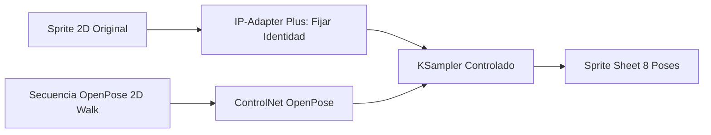
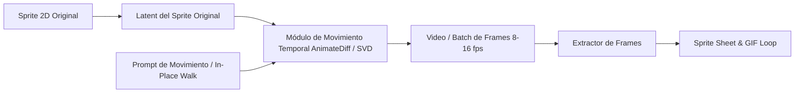
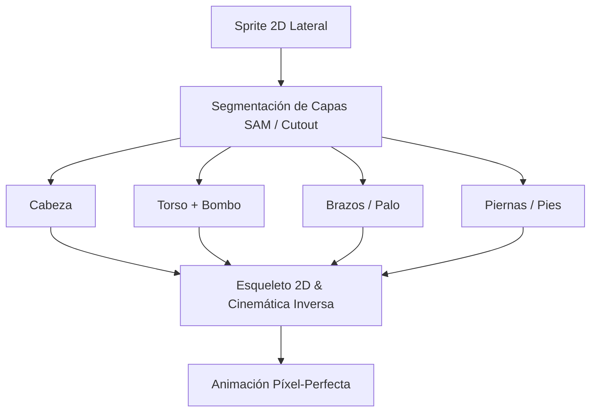

# 🎮 Estrategias para Animación de Sprites 2D a partir de una Imagen Estática

Este documento detalla las **tres arquitecturas técnicas** para transformar un sprite o personaje 2D en vista lateral (corte de perfil) en animaciones completas para videojuegos (Walk Cycle, Run, Idle, Attack, etc.) preservando su identidad artística.

---

## 📊 Comparativa de Enfoques

| Criterio | Opción 1: ControlNet + IP-Adapter | Opción 2: Video Diffusion (I2V / AnimateDiff / SVD) | Opción 3: Cutout Rigging 2D (Segmentación + IK) |
| :--- | :--- | :--- | :--- |
| **Fidelidad al Sprite Original** | ⭐⭐⭐⭐ (Alta con IP-Adapter Plus) | ⭐⭐⭐⭐⭐ (Máxima: anima los píxeles directos) | ⭐⭐⭐⭐⭐ (100% Píxel-Perfecto idéntico) |
| **Control de la Pose** | ⭐⭐⭐⭐⭐ (Control exacto por esqueleto OpenPose) | ⭐⭐⭐⭐ (Control temporal y direccional) | ⭐⭐⭐⭐⭐ (Control absoluto por rotación/IK) |
| **Generación de Sprite Sheets** | ⭐⭐⭐⭐⭐ (Matriz de N cuadros directa) | ⭐⭐⭐⭐⭐ (Extracción de fotogramas del video) | ⭐⭐⭐⭐⭐ (Exportación directa a PNG/Atlas) |
| **Requerimientos de GPU** | Medios (SD 1.5 + ControlNet: ~4-6 GB VRAM) | Medios-Altos (AnimateDiff: ~6 GB / SVD: ~8 GB) | Mínimos (CPU o GPU ligera) |
| **Ideal para** | Variaciones de ángulo y poses complejas | Movimiento orgánico fluido sin rigging manual | Juegos 2D tradicionales (Godot/Unity/Spine) |

---

## 🛠️ Opción 1: ControlNet (OpenPose Walk Cycle) + IP-Adapter Plus

### Concepto
Separa la **identidad visual** del **movimiento esquelético**. 
1. Se extrae el mapa de características del sprite mediante **IP-Adapter Plus** (bloqueando paleta, proporciones, ropa y rostro).
2. Se inyecta una secuencia predefinida de 8 o 12 esqueletos OpenPose en vista lateral que representan la cinemática de la caminata (Contact, Recoil, Passing, High Point).
3. **ControlNet** fuerza al modelo generativo a ubicar cada extremidad exactamente en las coordenadas de la pose sin redibujar al personaje.

* **Ventajas:** Permite cambiar la animación fácilmente cambiando las poses del esqueleto guía; control milimétrico de la posición de pies y manos.
* **Desventajas:** Requiere tener la plantilla de esqueletos OpenPose 2D lateral calibrada a la escala del personaje.

---

## 🎬 Opción 2: Video Diffusion (Image-to-Video / AnimateDiff / SVD) *(En Implementación)*

### Concepto
Aplica un **módulo de atención temporal** sobre el espacio latente del fotograma inicial.
1. El sprite original entra como fotograma ancla ($t_0$).
2. El modelo de difusión de video (AnimateDiff o Stable Video Diffusion SVD) infiere la continuidad de movimiento físico manteniendo coherencia espacio-temporal cuadro a cuadro.
3. Se extraen los fotogramas del bucle de video resultante y se empaquetan en un Sprite Sheet / GIF.

* **Ventajas:** Preserva el trazo, sombreado y estilo original con máxima naturalidad; no inventa un personaje nuevo.
* **Desventajas:** La caminata tiende a ser "en el lugar" (*walk in place*); se debe sincronizar el ciclo para un bucle perfecto.

---

## 🦴 Opción 3: Cutout Rigging 2D (Segmentación de Capas + IK)

### Concepto
El método clásico de la industria del videojuego (similar a Spine 2D, DragonBones o CoaTools en Godot).
1. El sprite 2D lateral se segmenta en sus componentes anatómicos independientes:
   * Cabeza y cuello.
   * Torso con bombo.
   * Brazo delantero y mano con palo.
   * Pierna delantera (muslo, pantorrilla, pie).
   * Pierna trasera (muslo, pantorrilla, pie).
   * Brazo trasero.
2. Las piezas recortadas y sus áreas ocluidas se generan/rellenan con inpainting de transparencia.
3. Se arma una jerarquía ósea con Cinemática Inversa (IK) para generar el ciclo de animación rotando las articulaciones.

* **Ventajas:** 100% de coherencia visual, peso ínfimo en memoria, reutilizable para cualquier animación adicional (correr, saltar, pegar, idle) sin re-generar.
* **Desventajas:** Requiere separación limpia de piezas y configuración del esqueleto.

---

## 🚀 Plan de Ejecución de la Opción 2 (Video Diffusion)

1. **Instalación de Nodos y Módulos de Movimiento**:
   * Descarga del módulo de movimiento temporal `mm_sd_v15_v2.ckpt` para AnimateDiff.
   * Integración de `ComfyUI-VideoHelperSuite` (VHS) para combinación de video, generación de GIF y Sprite Sheet.
2. **Construcción del Flujo Image-to-Video**:
   * Carga del sprite lateral preprocesado como fotograma ancla.
   * Inyección de guía de movimiento de caminata cíclica en el plano lateral.
3. **Exportación y Empaquetado de Assets**:
   * Generación del video a 8-12 fps.
   * Extracción automática de fotogramas a Sprite Sheet con fondo transparente o neutro.
